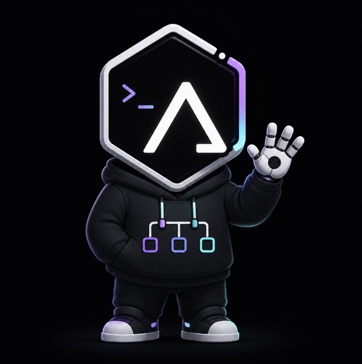

<div align="center">
  
</div>

# Aegis

Персональный автономный AI-агент, который живёт на твоей машине или VPS, доступен из мессенджера, помнит контекст между сессиями, умеет выполнять задачи по расписанию и расширяется навыками — но построен так, что **недоверенный вход, секреты и исполнение кода физически разделены**, а всё, что агент «узнаёт», проверяется прежде, чем повлиять на будущие сессии.

Это тот же класс продукта, что OpenClaw, Hermes и NanoClaw. Отличие — в том, чего у них нет: карантин недоверенного входа и память, которой можно доверять.

## Почему ещё один агент

Агенты этого класса обычно держат в одном процессе три вещи, которые вместе дают «lethal trifecta»: чтение недоверенного контента (письма, веб, сообщения), доступ к секретам (API-ключи, SSH) и способность действовать (shell, cron, браузер). Prompt injection в таком процессе превращается из курьёза в удалённое выполнение кода. Продукты класса защищаются проверками _внутри_ этого процесса (регэкспы, approval-промпты), тогда как единственная настоящая граница — изоляция на уровне ОС — у них опциональна.

NanoClaw сделал важный шаг: вынес исполнение в контейнеры, а секреты — в отдельный vault. Но недоверенный вход у него по-прежнему течёт прямо в тот же LLM-контекст, что и команды владельца, а памяти между сессиями с проверкой истинности нет вообще.

Aegis закрывает оба пробела:

- **Четыре trust-домена.** Вход, исполнение, секреты и доверенное ядро — в разных процессах/контейнерах с границами на уровне ОС, а не `if`-ов.
- **Верифицируемое обучение.** Новое знание рождается со статусом «не проверено» и не попадает в системный контекст, пока не пройдёт проверку. Отравить память через одну скомпрометированную сессию нельзя.
- **Бюджет как контракт.** Детерминированная работа бесплатна и всегда доступна; работа LLM списывается с явного дневного бюджета, при исчерпании — понятная деградация, а не тихий перерасход.

## Для кого

Технический владелец, которому нужен автономный агент 24/7, но который не готов принять ни trifecta-риск, ни накопление непроверенного мусора в памяти. Single-tenant, self-hosted.

Если тебе не нужен именно агент-в-мессенджере, а нужно просто закрывать задачи без trifecta-риска — вероятно, дешевле обычная декомпозиция (IDE-ассистент для кода, cron с узкими скриптами, точечные интеграции). Aegis оправдан, когда автономный агент в мессенджере нужен как продукт.

## Статус

**MVP достигнут (Sprint 10).** Агент разворачивается self-hosted по [`docs/DEPLOYMENT.md`](docs/DEPLOYMENT.md). Все критерии [`docs/MVP_SCOPE.md`](docs/MVP_SCOPE.md) отмечены и покрыты тестами V1–V4, V7.

Sprint 0–4: фундамент, ядро, Telegram, sandbox/broker, gate — см. ниже. Sprint 8–10: навыки, scheduler/budget, метрики `reuse_rate` + `/metrics`, learning policy (LLM self-improvement off by default).

### Разработка

```bash
# Node LTS (см. .nvmrc); локально допустим и более новый
npm ci --ignore-scripts && npm rebuild better-sqlite3
npm run lint && npm run typecheck && npm test
npm run test:security   # V2/V3: границы sandbox/broker; требует запущенный Docker
npm run loc   # контроль размера ядра (~4K LOC)

# Запуск хоста: нужен конфиг, env-ключи LLM и Telegram-бот
cp aegis.config.example.json aegis.config.json   # поправить под свой LLM
AEGIS_P_LLM_KEY=... AEGIS_Q_LLM_KEY=... \
AEGIS_TG_BOT_TOKEN=<токен от @BotFather> \
AEGIS_TG_PAIRING_CODE=<придуманный одноразовый код> npm start
```

Первый запуск: создать бота у @BotFather, задать env-переменные и написать боту `/pair <код>` со своего аккаунта — с этого момента бот отвечает только вам (владелец фиксируется в `channel_state`, повторный pairing невозможен). Чужие сообщения молча отклоняются с записью в audit log.

## Карта документов

| Документ                                           | О чём                                                       |
| -------------------------------------------------- | ----------------------------------------------------------- |
| [`docs/CONCEPT.md`](docs/CONCEPT.md)               | Полный концепт: принципы, дифференциаторы, позиционирование |
| [`ARCHITECTURE.md`](ARCHITECTURE.md)               | Компоненты, потоки данных, границы доменов                  |
| [`docs/TRUST_DOMAINS.md`](docs/TRUST_DOMAINS.md)   | Четыре trust-домена в деталях                               |
| [`docs/SECURITY_MODEL.md`](docs/SECURITY_MODEL.md) | Дефолты, гейты, что чем защищено                            |
| [`docs/THREAT_MODEL.md`](docs/THREAT_MODEL.md)     | Активы, злоумышленники, вектора, митигации                  |
| [`docs/LEARNING_LOOP.md`](docs/LEARNING_LOOP.md)   | Память, эпистемические статусы, promotion                   |
| [`docs/SKILLS_MODEL.md`](docs/SKILLS_MODEL.md)     | Навыки как данные, capability-манифесты                     |
| [`docs/MEMORY_SCHEMA.md`](docs/MEMORY_SCHEMA.md)   | Схема данных: очереди, память, аудит (DDL)                  |
| [`docs/REPO_LAYOUT.md`](docs/REPO_LAYOUT.md)       | Скелет репозитория и тулчейн                                |
| [`docs/TOKEN_ECONOMY.md`](docs/TOKEN_ECONOMY.md)   | Бюджет, деградация, метрика ценности                        |
| [`docs/MVP_SCOPE.md`](docs/MVP_SCOPE.md)           | Что входит в первую версию, критерии готовности MVP         |
| [`docs/DEPLOYMENT.md`](docs/DEPLOYMENT.md)         | Self-hosted развёртывание (pairing, env, broker)            |
| [`docs/GLOSSARY.md`](docs/GLOSSARY.md)             | Термины                                                     |
| [`docs/adr/`](docs/adr/)                           | Architecture Decision Records                               |
| [`ROADMAP.md`](ROADMAP.md)                         | Этапы разработки (фазы)                                     |
| [`docs/SPRINTS.md`](docs/SPRINTS.md)               | Спринт-план: фазы, разложенные на 2-недельные спринты       |

## Лицензия

[MIT](LICENSE) — используйте, форкайте, встраивайте. Контрибуции приветствуются — см. [CONTRIBUTING.md](CONTRIBUTING.md), об уязвимостях — [SECURITY.md](SECURITY.md).
